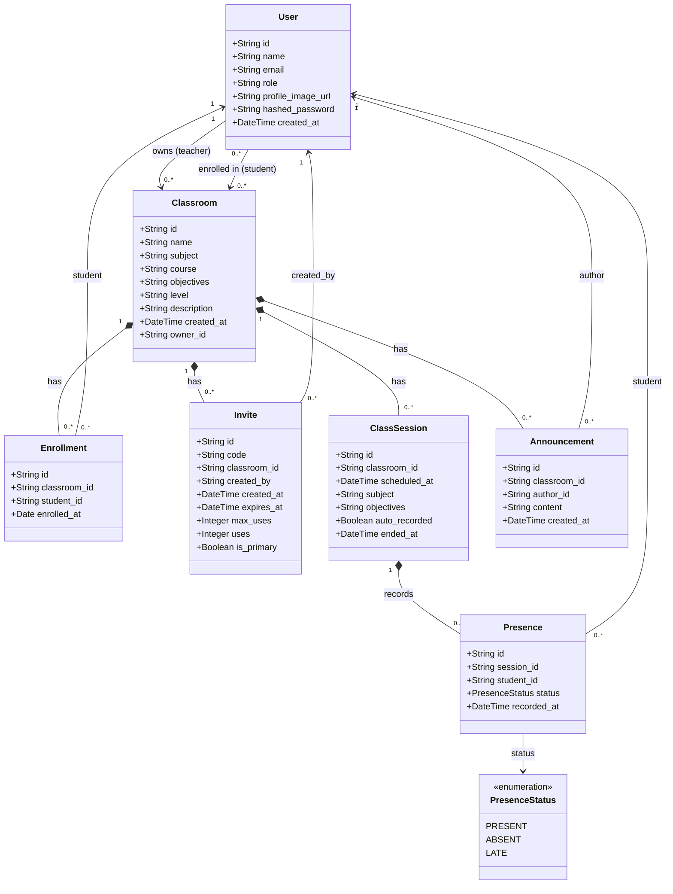

# Class Diagram — Teacher Classroom Management

## Class descriptions

| Class | Role |
|-------|------|
| `User` | User account (teacher or student). The `role` field distinguishes the two. |
| `Classroom` | A classroom owned by a teacher (`owner_id`). |
| `Enrollment` | Join table linking a student to a classroom, with the enrollment date. |
| `Invite` | Invite code that lets a student join a classroom. `is_primary = true` = the classroom's permanent join code. |
| `ClassSession` | An attendance session. `ended_at = null` means the session is still open. |
| `Presence` | Attendance status of a student for a given session (PRESENT / ABSENT / LATE). |
| `Announcement` | A message posted by the teacher in the classroom stream, visible to all enrolled students. |
