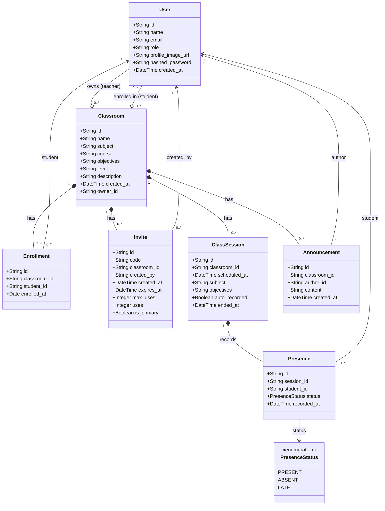

# Class Diagram — Teacher Classroom Management

## Description des classes

| Classe | Rôle |
|--------|------|
| `User` | Compte utilisateur (teacher ou student). Le champ `role` distingue les deux. |
| `Classroom` | Salle de classe appartenant à un enseignant (`owner_id`). |
| `Enrollment` | Table d'association liant un étudiant à une salle de classe avec la date d'inscription. |
| `Invite` | Code d'invitation permettant à un étudiant de rejoindre une salle. `is_primary = true` = code permanent de la classe. |
| `ClassSession` | Séance de prise de présences. `ended_at = null` signifie que la séance est en cours. |
| `Presence` | Statut de présence d'un étudiant pour une séance donnée (PRESENT / ABSENT / LATE). |
| `Announcement` | Message posté par l'enseignant dans le fil de la salle, visible par tous les inscrits. |
