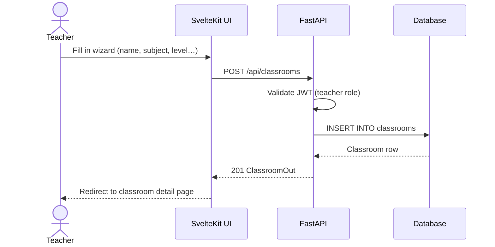
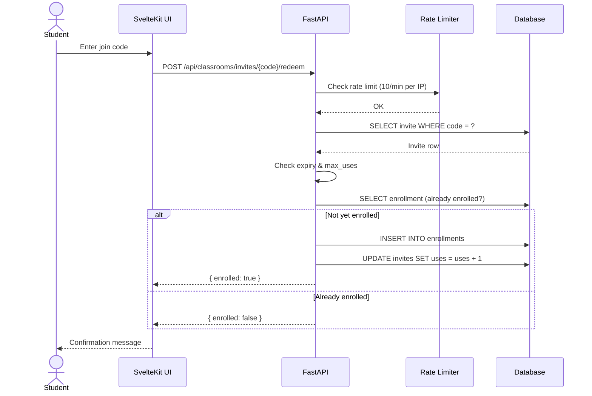
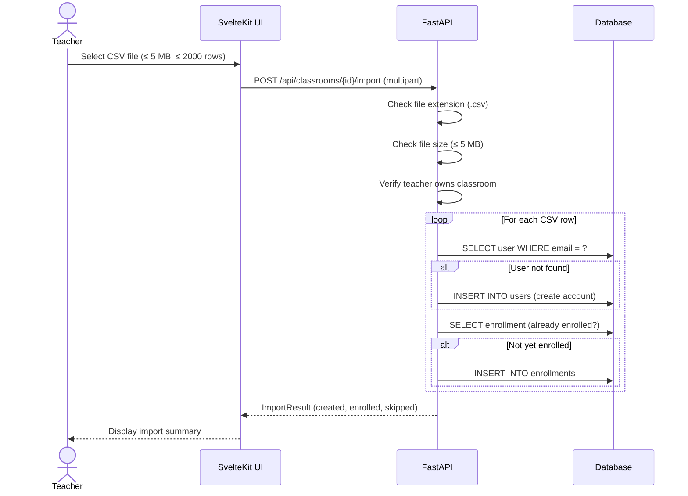
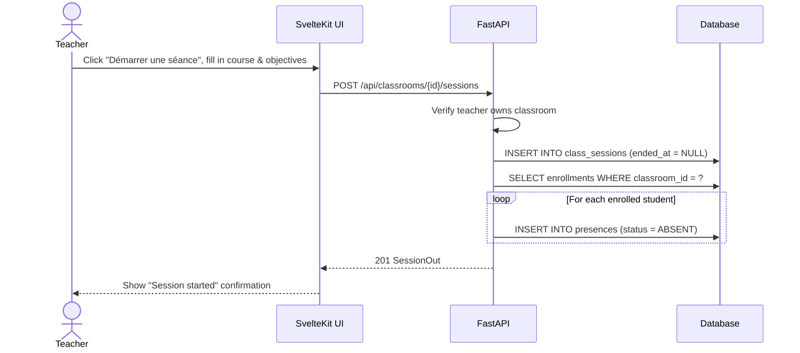
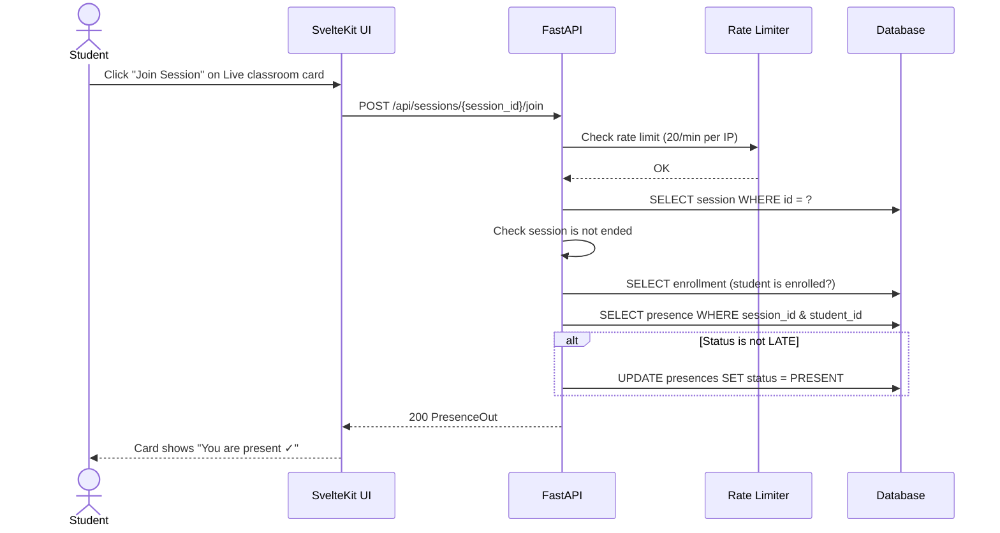
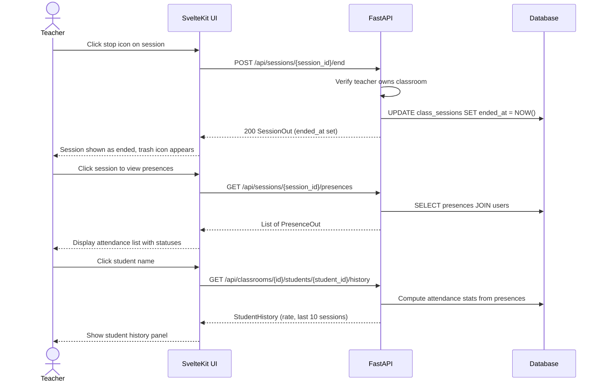
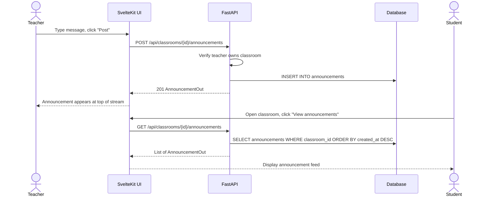

# Sequence Diagrams — Teacher Classroom Management

---

## 1. Create a classroom

---

## 2. Enroll a student via join code

---

## 3. Import students from CSV

---

## 4. Start an attendance session

---

## 5. Student joins a live session (self check-in)

---

## 6. End a session and view attendance

---

## 7. Post an announcement

