# Classroom Management — User Guide

## Overview

This guide explains how to manage a classroom in Open TutorAI CE. Teachers can create classrooms, add students, run live attendance sessions, post announcements, and see the class as a 3D seating chart. Students can join a classroom with a code, check themselves present during a live session, and read class announcements.

---

## For Teachers

### 1. Teacher Dashboard

When you log in as a teacher you land on the Dashboard, which shows a quick summary of your classrooms and your total student count.

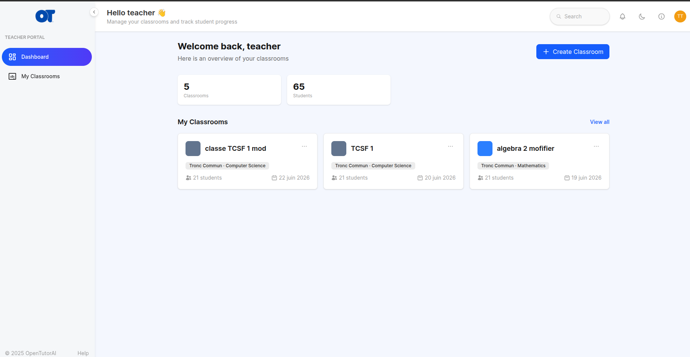

Click **My Classrooms** in the sidebar to see all your classrooms, or **+ Create Classroom** to start a new one.

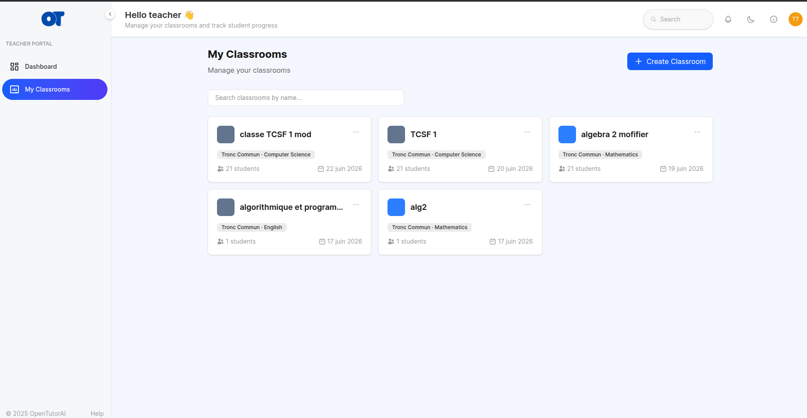

---

### 2. Create a classroom

Click **+ Create Classroom** on the My Classrooms page. A six-step wizard opens.

**Step 1 — Name & Subject**

Fill in the classroom name, a short description, and choose the subject.

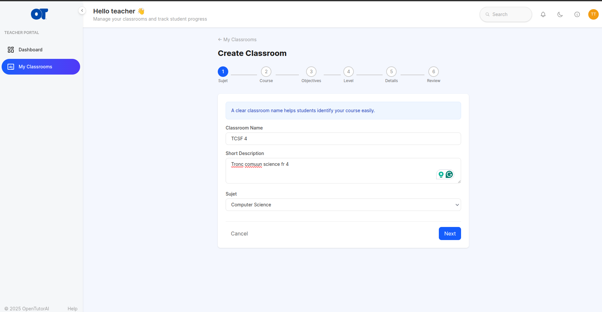

Steps 2–5 ask for the course, objectives, level, and other details. When you reach **Step 6 — Review**, you see a summary of everything before confirming.

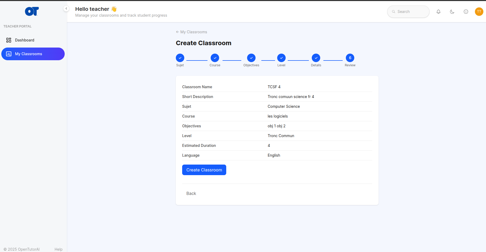

Click **Create Classroom** to finish. You are taken directly to the new classroom's detail page.

---

### 3. Edit or delete a classroom

From the classroom detail page, use the **Edit** and **Delete** buttons in the top-right corner.

**Edit** opens a form pre-filled with the current values:

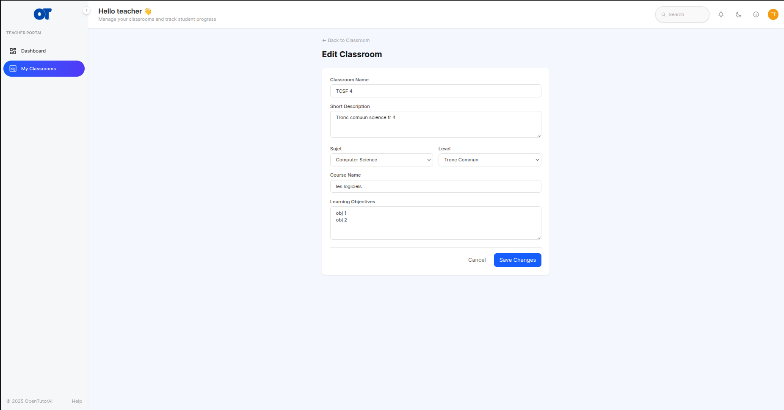

**Delete** asks for confirmation and lists exactly what will be removed:

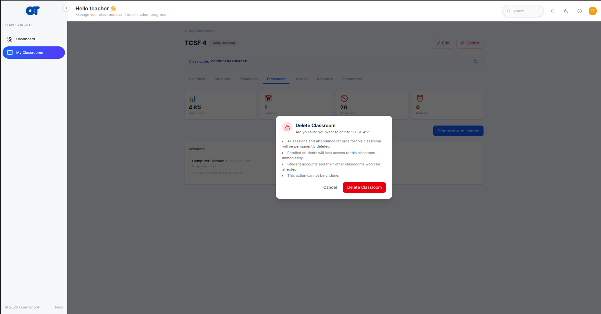

---

### 4. Add students to your classroom

Open the **Students** tab. When no students are enrolled yet, you see an empty state:

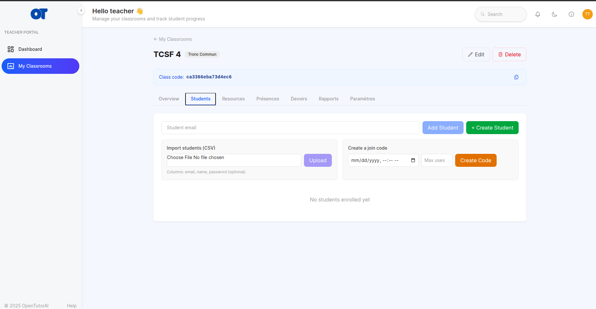

You have three options:

- **Add by email** — type a student's email in the top bar and click **Add Student**. The student must already have an account. Use **+ Create Student** to create an account on the spot.
- **Import a CSV** — prepare a file with the columns `email`, `name`, `password` (password is optional). Choose the file and click **Upload**. The result shows how many students were created, enrolled, or skipped.
- **Share the class code** — the permanent join code is shown at the top of the classroom page. Copy and share it with your students.

Once students are enrolled, the list view shows names, emails, and enrollment dates:

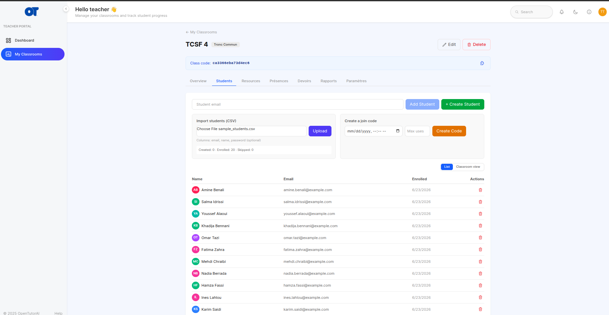

---

### 5. View the 3D seating chart

Switch from **List** to **Classroom view** on the Students tab. Three layout buttons appear above the scene.

**Rows** — desks facing the board in a classic row arrangement:

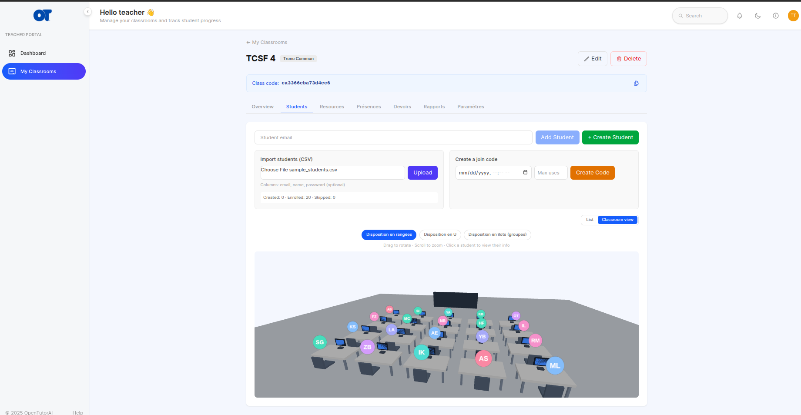

**U-shape** — desks arranged in a U around the board:

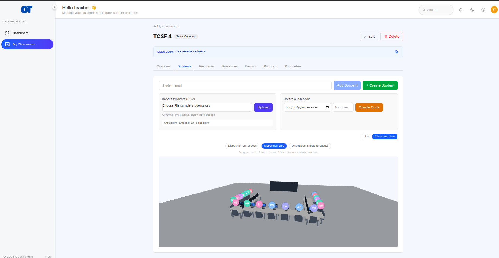

**Islands (groups)** — clusters of four desks, ideal for group work:

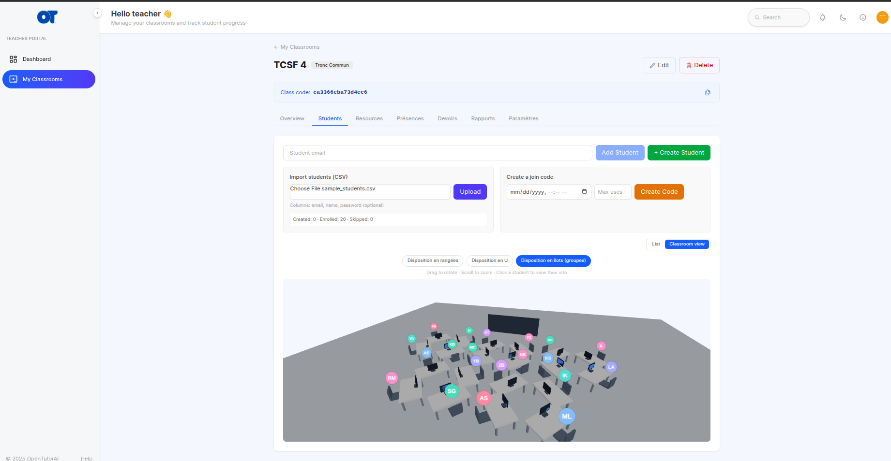

Drag to rotate the view and scroll to zoom. Hover over a student's avatar to see their name; click to open their info card.

---

### 6. Start a live attendance session

Go to the **Présences** tab. When no session has run yet, the counters all show zero:

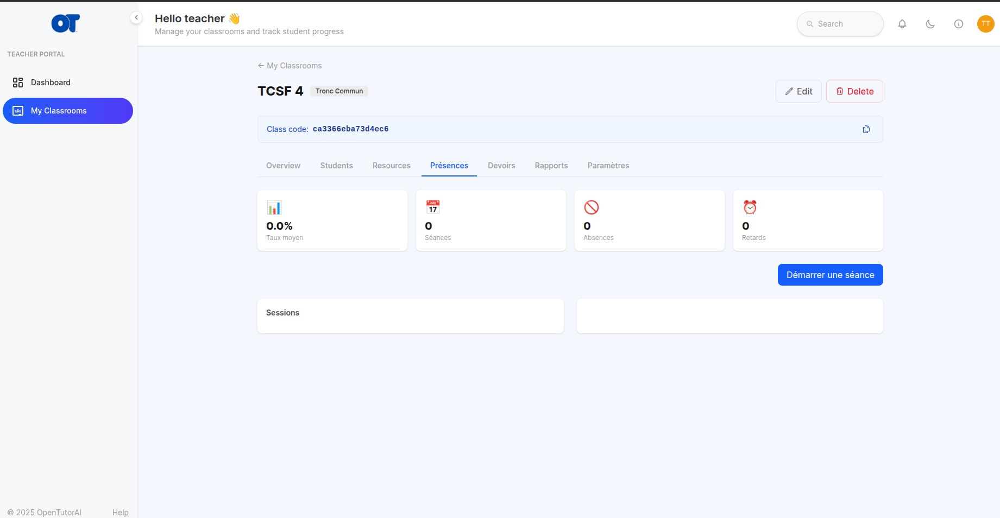

Click **Démarrer une séance** (Start a session). A modal opens where you enter the course name and the objectives for this session:

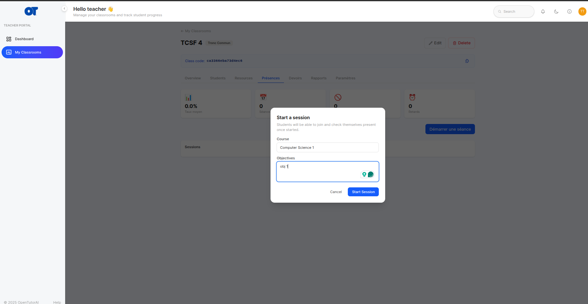

Click **Start Session**. A confirmation screen shows the course, start time, and objectives:

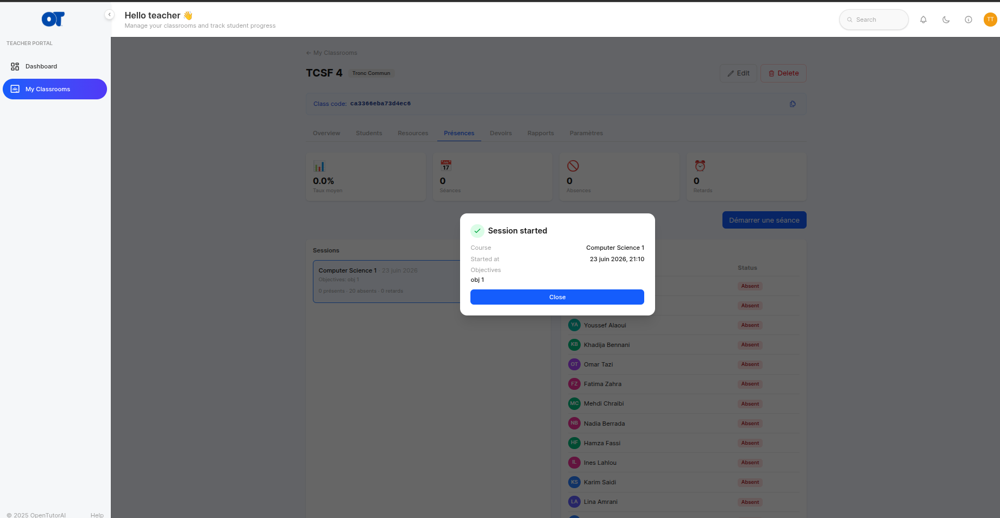

Close the modal. The session now appears in the session list. All enrolled students start out marked **Absent** — they become **Present** by joining the session themselves.

---

### 7. View attendance and student history

Click a session in the list. The right panel shows every student and their status. Click any student to see their individual history (presence %, absence %, last 10 sessions):

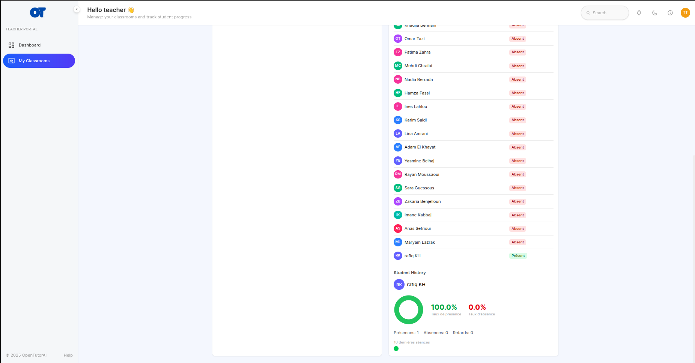

---

### 8. End and delete a session

- Click the **stop icon** next to an in-progress session to end it. Once ended, students can no longer join.
- Once ended, a **trash icon** appears — click it to permanently delete the session and its attendance records (a confirmation prompt appears).

---

### 9. Post an announcement

Go to the **Overview** tab, type a message in the announcement box, and click **Post**. The announcement appears at the top of the stream for all enrolled students.

---

## For Students

### 1. My Classrooms page

Students see all their enrolled classrooms on the **My Classrooms** page. Classrooms with an open attendance session show a green **Live** badge and a **Join Session** button:

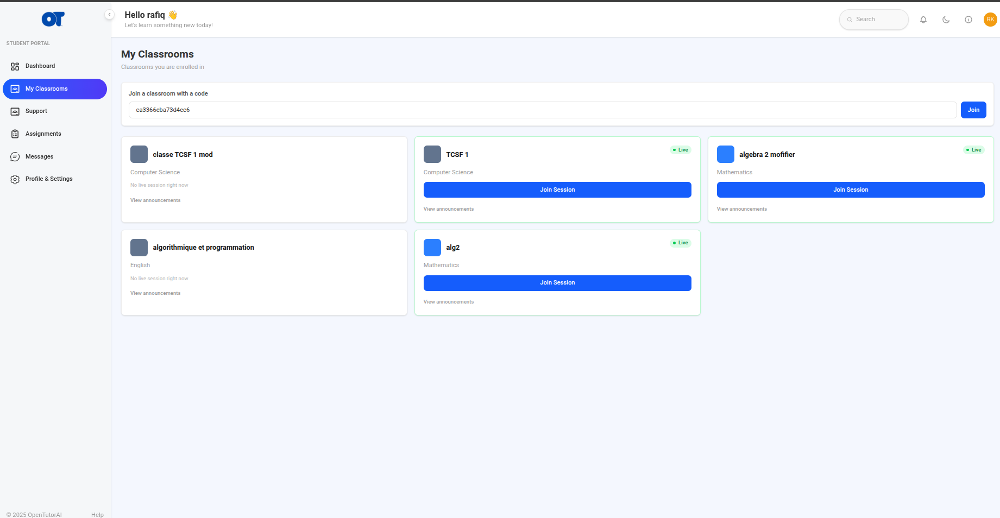

### 2. Join a live session (mark yourself present)

Click **Join Session** on a Live classroom card. Once you join, the card confirms your attendance:

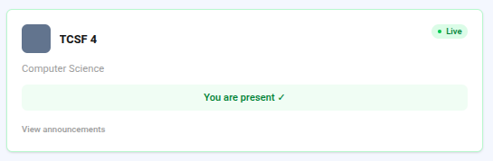

If the session has ended, the button is hidden and the Live badge disappears.

### 3. Join a classroom with a code

On the My Classrooms page, enter the code your teacher shared in the **"Join a classroom with a code"** field and click **Join**.
